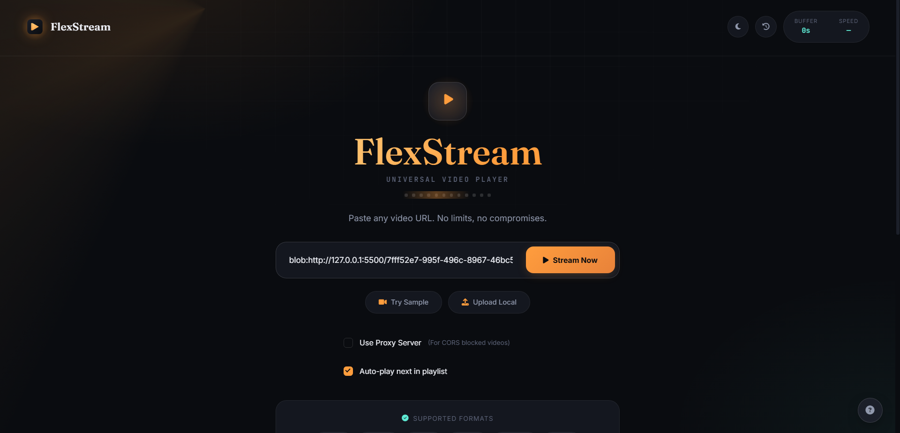
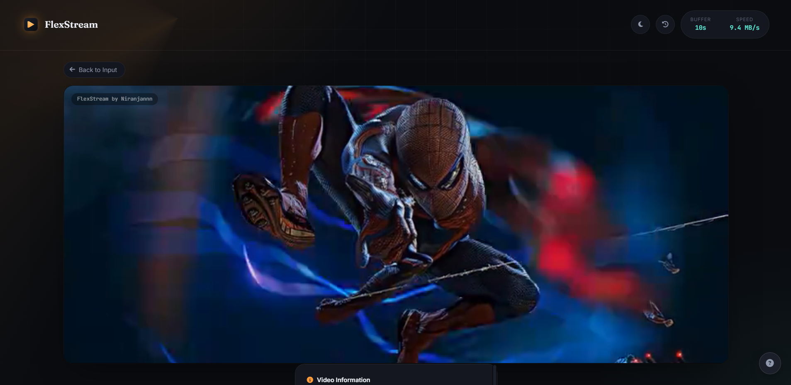
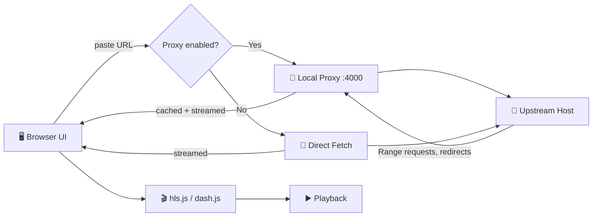

<div align="center">


<br>


<br>


<sub>A sleek, self-hosted player that streams literally anything you throw a URL at</sub>

<br>


<br>


</div>

<br>

<div align="center">

[](#-quick-start)
[](#-features)
[](#%EF%B8%8F-configuration)
[](#-troubleshooting)

</div>


<br>

**FlexStream** turns any video URL — MP4, WebM, MKV, HLS manifests, DASH streams, even raw audio — into an instant, buffery-smooth playback session. No installs on the video side, no format juggling. Paste a link, hit stream.

<br>

<div align="center">
  
</div>
<br>
<div align="center">
  
</div>


## ✨ Features

<table>
<tr>
<td width="50%" valign="top">

### 🎥 Video Streaming
- **Universal format support** — MP4, WebM, MKV, HLS, DASH, MP3, OGG & more
- **Direct URL streaming** — paste a link, start instantly
- **Built-in proxy** — bypasses CORS restrictions transparently
- **Smart buffering** — adaptive buffer management for stutter-free playback
- **Live network readout** — real-time speed & buffer-health monitoring

</td>
<td width="50%" valign="top">

### 🎮 Playback Controls
- **Full control suite** — play, pause, skip, volume, speed
- **Keyboard-first** — every action has a shortcut
- **Picture-in-Picture** — keep watching while you browse
- **True fullscreen** — immersive, edge-to-edge viewing
- **Loop & repeat** — whole video or a specific segment
- **Timestamped screenshots** — capture any frame in one click

</td>
</tr>
<tr>
<td width="50%" valign="top">

### 📊 Advanced Features
- **Watch history** — automatically tracked, easy to revisit
- **Favorites** — bookmark the videos you care about
- **Playlists** — queue up and manage multiple videos
- **Usage statistics** — total play time, videos played, data used
- **Subtitle support** — load external `.vtt` / `.srt` files
- **Time-jump input** — type a timestamp, land there instantly

</td>
<td width="50%" valign="top">

### 🛡️ Security & Privacy
- **Rate limiting** — per-IP request caps to prevent abuse
- **Domain filtering** — allow/block lists for upstream hosts
- **Content validation** — checked before it ever reaches your player
- **Local-only storage** — nothing leaves your device
- **Zero tracking** — no analytics, no telemetry, ever

</td>
</tr>
</table>

<br>

## 🚀 Quick Start

**Prerequisites:** Node.js ≥ 14.0 · a modern browser

```bash
git clone https://github.com/itsniranjannn/flexstream.git
cd flexstream/server
npm install
npm start
```

Then open **`http://localhost:4000`** — that's it.

> **Tip:** `npm run dev` hot-reloads the server with `nodemon` if it's installed as a devDependency.

<br>

## 🧭 How It Works



1. Open the UI, served straight from `public/`
2. Paste a URL, or drop in a local file
3. Toggle **Use Proxy Server** to route through the local proxy (handles CORS, redirects, and Range headers for seeking)
4. Small responses get cached in `.cache/` to save bandwidth on repeat requests
5. `.m3u8` and `.mpd` manifests are automatically handed off to `hls.js` / `dash.js`

<br>

## ⚙️ Configuration

| Setting | Default | Where |
|---|:---:|---|
| Server port | `4000` | `PORT` in `server/server.js` |
| Cache directory | `.cache/` | auto-created |
| Max cache size | `100 MB` | `server/server.js` |
| Cacheable file size | `< 10 MB` | `server/server.js` |
| Rate limit | `100 req/min/IP` | `RATE_LIMIT_MAX` |
| Security filters | domains / content-type / size | `SECURITY` object |

<details>
<summary><b>📁 Project structure</b></summary>

<br>

```
flexstream/
├── server/
│   ├── server.js        # HTTP server, proxy, cache, rate limiting
│   └── package.json      # scripts & dependencies
├── public/
│   ├── index.html        # player UI
│   ├── player.js          # client-side playback logic
│   └── styles.css         # styling
└── assets/
    ├── demo-videos/       # sample media
    └── screenshots/        # UI captures
```

</details>

<details>
<summary><b>🔌 Admin endpoints</b></summary>

<br>

| Endpoint | Description |
|---|---|
| `GET /api/stats` | Cache stats + rate-limit usage |
| `POST /api/clear-cache` | Wipes the local cache |

</details>

<br>

## 🩹 Troubleshooting

| Issue | Fix |
|---|---|
| ❌ "Unable to load video" | Check DevTools → Network for the response code. If proxying, confirm the host isn't in `SECURITY.blockedDomains`. |
| ⏱️ Seeking doesn't work | Upstream may not support Range requests — `player.js` auto-probes with `HEAD` + `Range` to detect this. |
| 🌐 CORS errors | Turn on **Use Proxy Server** — it adds permissive CORS headers for you. |
| 🚫 Server won't start | Confirm Node.js ≥ 14 and that `npm install` completed cleanly inside `server/`. |

<br>

## 🔒 Privacy & Security

> FlexStream's proxy fetches third-party URLs on your behalf — use it thoughtfully, and avoid pointing it at private or sensitive endpoints. Basic domain and content-type/size checks are included, but this is **not** a hardened production-grade proxy out of the box.

<br>

## 🗺️ Roadmap

- [ ] Environment-based config (`$PORT`, cache-size env vars)
- [ ] Persistent cache index with TTL tuning & eviction metrics
- [ ] Proper IP/CIDR library for domain blocking
- [ ] Authentication/ACL for admin endpoints
- [ ] Unit & integration test coverage for proxy + cache logic

<br>

---

<div align="center">

Made by **[Niranjannn](https://github.com/itsniranjannn)**


<sub>If FlexStream saved you from another janky embed player, a ⭐ goes a long way.</sub>

</div>

